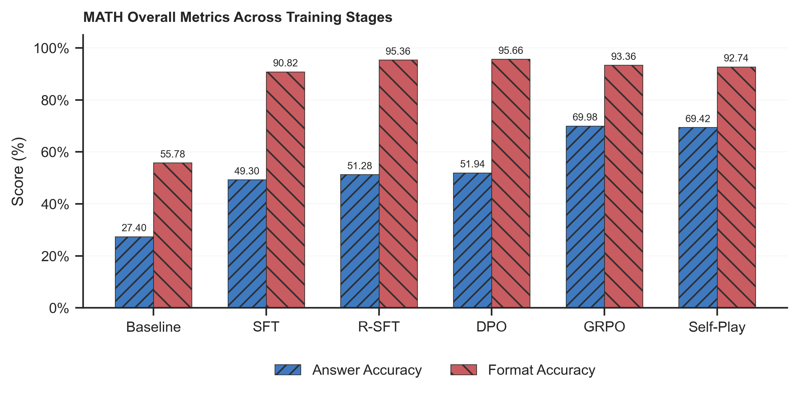
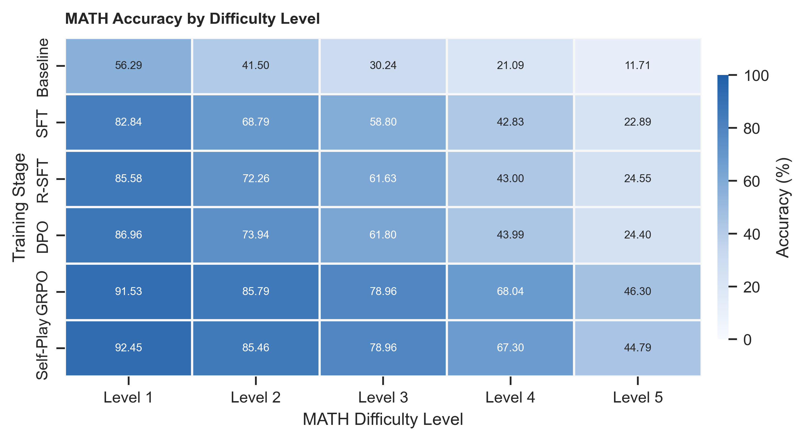
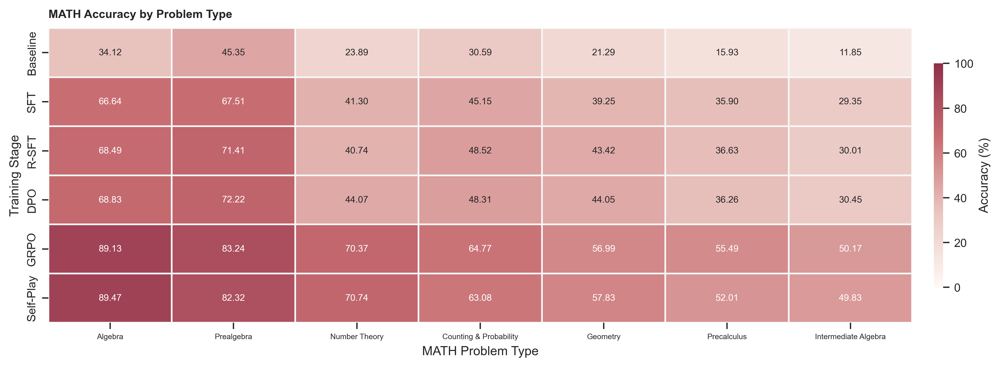
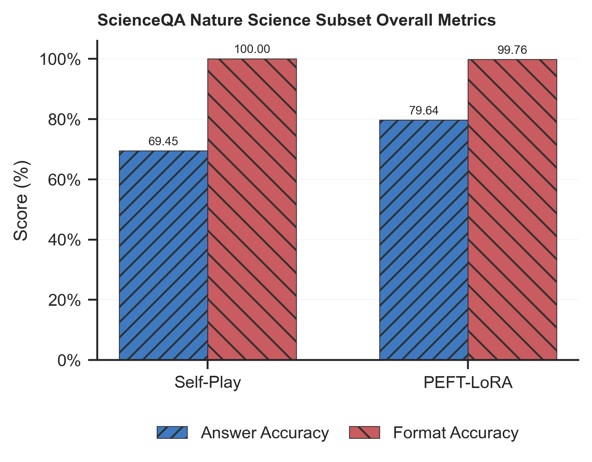
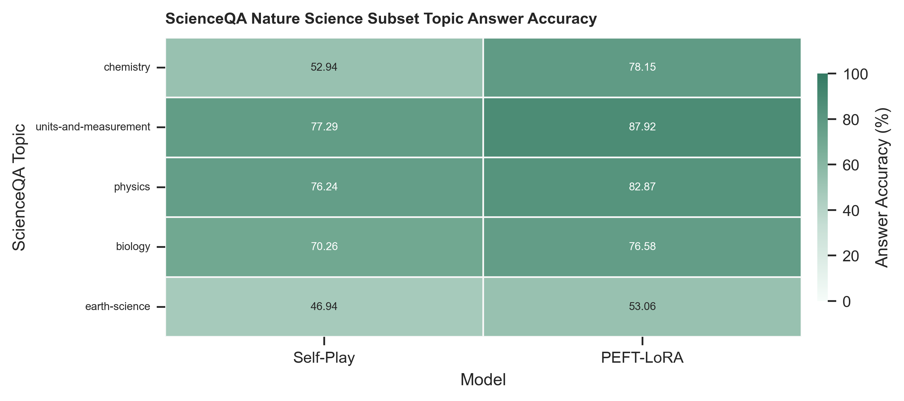
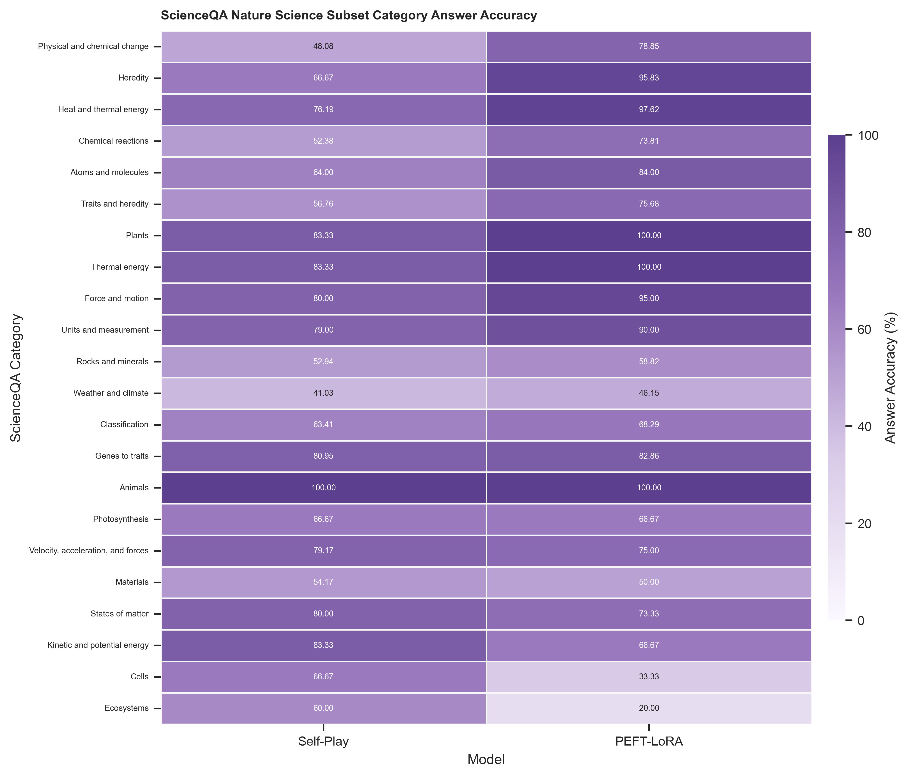

# Technical Challenge 2026 项目总结

本文总结本仓库对 Technical Challenge 2026 后训练任务的完整实现流程与实验结果。项目围绕 `Qwen2.5-Math-1.5B` 搭建了一条从数学推理到跨领域参数高效微调的后训练流水线：

```text
Baseline -> SFT -> RSFT/EI -> DPO -> GRPO/RLVR -> Self-Play -> PEFT/LoRA
```

代码没有使用 `Trainer`、TRL、PEFT 等高级训练封装库；训练循环、response mask、loss、偏好优化、GRPO clip objective 和 LoRA 注入都在 `src/` 下手写实现。模型加载使用 Transformers，批量离线推理和采样使用 vLLM。

## 1. 任务要求与项目范围

`docs/Technical Challenge 2026.pdf` 要求实现大模型后训练流程，核心目标不是追求固定分数，而是给出一套可运行、可检查、可复现实验曲线与准确率对比的实现。任务指定基础模型为 `Qwen2.5-Math-1.5B`，数学主任务推荐使用 MATH 数据集，后续 PEFT 阶段要求在非数学领域做跨领域微调，并要求 LoRA 模块自行实现。

本项目对应实现如下：

| 阶段 | 代码入口 | 核心文件 | 数据/任务 | 输出模型路径 |
|---|---|---|---|---|
| Baseline | `scripts/eval.py --config configs/eval/baseline.yaml` | `scripts/eval.py`, `src/grader.py` | MATH test zero-shot | 无训练 |
| SFT | `scripts/train_sft.py --config configs/train/sft.yaml` | `src/sft.py` | MATH train | `outputs/train/sft/model` |
| RSFT/EI | `scripts/sample_rsft.py`, `scripts/train_rsft.py` | `src/rsft.py` | MATH train 采样过滤 | `outputs/train/rsft/model` |
| DPO | `scripts/sample_dpo.py`, `scripts/train_dpo.py` | `src/dpo.py` | MATH train 偏好对 | `outputs/train/dpo/model` |
| GRPO/RLVR | `scripts/train_grpo.py` | `src/grpo.py` | MATH train verified reward | `outputs/train/grpo/model` |
| Self-Play | `scripts/train_self_play.py` | `src/self_play.py` | 自生成数学题和自解样本 | `outputs/train/self_play/model` |
| PEFT/LoRA | `scripts/train_peft.py` | `src/peft.py` | ScienceQA 自然科学选择题 | `outputs/train/peft/model` |

统一的后台运行脚本在 `shell/run_job.sh`，支持 `eval-baseline`、`train-sft`、`sample-rsft`、`train-rsft`、`sample-dpo`、`train-dpo`、`train-grpo`、`train-self-play`、`train-peft` 等任务。

## 2. 数据集与模型准备

### 2.1 基础模型

项目使用 `Qwen/Qwen2.5-Math-1.5B`，下载到本地：

```text
models/Qwen2.5-Math-1.5B
```

下载逻辑在 `scripts/download.py::save_qwen_math_model()` 中，通过 `huggingface_hub.snapshot_download()` 保存到 `models/`。配置中统一使用 bfloat16，attention 后端默认设为 `sdpa`，并在训练阶段开启 gradient checkpointing 以降低激活显存。

### 2.2 MATH 数据集

数学推理阶段使用 `EleutherAI/hendrycks_math`。`scripts/download.py::save_math()` 会读取该数据集的所有 config，并将各 config 的 split 合并成一个本地 `DatasetDict`：

```text
data/math
```

主要字段：

| 字段 | 用途 |
|---|---|
| `problem` | 题目文本，作为 prompt 中的 `{question}` |
| `solution` | 标准解析，包含最终 `\boxed{...}` |
| `level` | 难度，Level 1 到 Level 5 |
| `type` | 题型，如 Algebra、Geometry、Number Theory 等 |

训练阶段使用 `train` split，评估阶段使用 `test` split。当前评估产物显示 MATH test 共 5000 道题。

### 2.3 ScienceQA 自然科学子集

PEFT 阶段没有继续使用数学数据，而是使用 `derek-thomas/ScienceQA` 的过滤子集。过滤逻辑在 `scripts/download.py`：

```python
item.get("subject") == "natural science"
and item.get("image") is None
and solution != ""
and isinstance(answer, int)
and 0 <= answer < len(choices)
```

保存路径：

```text
data/scienceqa
```

保留字段包括 `question`、`choices`、`answer`、`answer_letter`、`answer_text`、`hint`、`solution`、`grade`、`topic`、`category`、`skill` 等。这样 PEFT 任务变成自然科学多选题，答案只要求输出 A 到 E 中的一个选项。当前 ScienceQA test 评估样本数为 825。

## 3. Prompt 与答案格式

数学阶段的 prompt 在各配置文件中保持一致。系统提示要求模型逐步推理，并严格输出：

```text
<think>
reasoning process here
</think> <answer>
final answer here
</answer>
```

项目实现中进一步要求：

- `<answer>` 内只放最终结果，不放解释。
- 不使用 `\boxed{}` 包裹模型答案。
- vLLM 推理时设置 `stop=["</answer>"]`，并保留 stop 字符串，避免模型生成到长度上限。

ScienceQA 阶段同样使用 `<think>...</think> <answer>...</answer>`，但 `<answer>` 中只能是选项字母。

## 4. 答案验证与 reward

数学评估和 RL/RL-like 采样均使用 `src/grader.py::r1_zero_reward_fn()`。该函数来自 R1-Zero 风格数学验证器，先检查格式，再抽取 `<answer>` 中的答案，并与 ground truth 做多层匹配：

1. 若 response 中不存在 `</think> <answer>` 或 `</answer>`，则 `format_reward=0`，`reward=0`。
2. 若存在合法格式，抽取 `<answer>` 内容。
3. 若模型答案中含 `\boxed{}`，先解析 boxed 内容。
4. ground truth 若为 MATH `solution`，通过 `extract_answer()` 提取最后一个 `\boxed{...}`。
5. 使用 `mathd_normalize_answer()`、SymPy、LaTeX parser、`math_verify` 等方式比较。
6. 正确时返回：

```json
{"format_reward": 1.0, "answer_reward": 1.0, "reward": 1.0}
```

7. 格式正确但答案错误时：

```json
{"format_reward": 1.0, "answer_reward": 0.0, "reward": 0.0}
```

`scripts/eval.py` 中还会把 `</think>\n<answer>` 等空白差异规范化为 `</think> <answer>`，避免仅因换行导致格式误判。

ScienceQA 的评估在 `scripts/eval_scienceqa.py`，通过 `src/peft.py::extract_choice_answer()` 从 `<answer>A</answer>` 中抽取选项；若标签不完整，也会 fallback 到最后一个 A-E 字母。

## 5. Baseline 评估

Baseline 使用未微调的 `models/Qwen2.5-Math-1.5B`，配置在 `configs/eval/baseline.yaml`。

关键配置：

| 项 | 值 |
|---|---|
| 数据 | `data/math`, `test` split |
| 推理框架 | vLLM |
| temperature | 0.0 |
| top_p | 1.0 |
| max_tokens | 1024 |
| stop | `</answer>` |
| grader | `r1_zero_reward_fn`, `fast=false` |

评估输出：

```text
outputs/eval/baseline/predictions.jsonl
outputs/eval/baseline/summary.json
outputs/eval/baseline/metrics_by_level.json
outputs/eval/baseline/metrics_by_type.json
```

Baseline 在 MATH test 上准确率为 27.40%，格式正确率为 55.78%。这说明 base 模型已有一定数学能力，但对指定 `<think>/<answer>` 格式并不稳定。

## 6. SFT

### 6.1 原理

SFT 是最大似然训练。对于 prompt `x` 和目标 response `y`，优化：

```text
L_SFT = - mean_t log pi_theta(y_t | x, y_<t)
```

为了只训练模型生成 response 的能力，而不是让模型学习复读 prompt，项目构造了 `response_mask`。prompt token 和 padding token 的 mask 为 0，response token 的 mask 为 1。

### 6.2 样本构造

实现位置：`src/sft.py`

样本加载流程：

1. 从 `data/math` 读取 train split。
2. 取 `problem` 作为问题。
3. 取 `solution` 作为 reasoning 轨迹。
4. 使用 `extract_boxed_answer()` 从 `solution` 中解析最后的 `\boxed{...}`。
5. 若样本没有 boxed answer 且 `skip_without_boxed_answer=true`，跳过。
6. 用统一 prompt 构造输入。
7. response 构造成：

```text
{solution}</think> <answer>{final_answer}</answer>
```

注意：prompt 模板末尾已经包含 `<think>`，所以 response 从完整的 solution reasoning 开始，随后闭合 `</think>` 并输出最终答案。

### 6.3 Tokenization 与 collator

`MathSFTDataset` 分别 tokenize prompt 和 response：

```python
prompt_ids = tokenizer(ex.prompt, add_special_tokens=False)["input_ids"]
response_ids = tokenizer(ex.response, add_special_tokens=False)["input_ids"]
input_ids = prompt_ids + response_ids
response_mask = [0] * len(prompt_ids) + [1] * len(response_ids)
```

如果 `add_eos_token=true`，在 response 末尾追加 EOS。长度由 `max_length=2048` 限制；prompt 太长或 response 截断后为空的样本会被过滤。`SFTDataCollator` 按 batch 最大长度 padding，并补齐到 8 的倍数。

### 6.4 Loss 实现

实现位置：`src/sft.py::masked_response_cross_entropy()`

模型输出 logits 后做 next-token prediction：

```python
shift_logits = logits[:, :-1, :]
shift_labels = input_ids[:, 1:]
shift_mask = response_mask[:, 1:].float()
log_probs = torch.log_softmax(shift_logits, dim=-1)
target_log_probs = torch.gather(log_probs, dim=-1, index=shift_labels.unsqueeze(-1)).squeeze(-1)
loss = -(target_log_probs * shift_mask).sum() / shift_mask.sum()
```

同时记录 response token 上的 entropy，作为训练动态指标。

### 6.5 训练配置

配置文件：`configs/train/sft.yaml`

| 项 | 值 |
|---|---|
| 初始模型 | `models/Qwen2.5-Math-1.5B` |
| epoch | 2 |
| train batch size | 8 |
| gradient accumulation | 4 |
| 有效 batch size | 32 |
| learning rate | `5e-6` |
| weight decay | 0.01 |
| optimizer | AdamW, betas `(0.9, 0.95)` |
| scheduler | cosine |
| warmup ratio | 0.05 |
| max grad norm | 1.0 |
| dtype | bfloat16 |
| gradient checkpointing | true |

SFT 后 MATH test 准确率从 27.40% 提升到 49.30%，格式正确率从 55.78% 提升到 90.82%。

## 7. RSFT / Expert Iteration

### 7.1 原理

RSFT 使用当前模型采样多个回答，只保留 reward 高的回答，再用这些模型自产的高质量回答做 SFT。它近似优化 reward-weighted distribution：

```text
p_RS(y | x) proportional to pi_theta(y | x) * 1[R(x, y) >= tau]
```

本项目实现为 Expert Iteration 风格：

1. 使用 SFT 模型对每道 MATH 训练题采样多个候选回答。
2. 用 `r1_zero_reward_fn` 验证候选是否正确。
3. 每题最多保留 1 个正确回答。
4. 对保留样本继续做 masked response cross entropy。

### 7.2 采样配置

配置文件：`configs/train/rsft.yaml`

| 项 | 值 |
|---|---|
| 初始模型 | `outputs/train/sft/model` |
| 采样框架 | vLLM |
| temperature | 0.5 |
| top_p | 0.95 |
| max_tokens | 1024 |
| min_tokens | 1 |
| n | 8 |
| stop | `</answer>` |
| reward threshold | 1.0 |
| max accepted per prompt | 1 |
| 输出样本 | `outputs/train/rsft/rsft_samples.jsonl` |

采样实现位置：`src/rsft.py::generate_rsft_data()`。

每个候选都会记录：

```json
{
  "index": "...",
  "sample_id": "...",
  "question": "...",
  "ground_truth": "...",
  "model_answer": "...",
  "prompt": "...",
  "response": "...",
  "reward_info": "...",
  "metadata": "..."
}
```

### 7.3 训练方式

`src/rsft.py::train_rsft()` 复用 SFT 的 `MathSFTDataset`、`SFTDataCollator` 和 `masked_response_cross_entropy()`。区别在于 response 不再来自人工 `solution`，而是来自通过 reward 过滤后的模型回答。

训练配置基本与 SFT 相同：

| 项 | 值 |
|---|---|
| epoch | 2 |
| effective batch size | 32 |
| learning rate | `5e-6` |
| scheduler | cosine |
| warmup ratio | 0.05 |

RSFT 后准确率为 51.28%，相比 SFT 增加 1.98 个百分点；格式正确率提升到 95.36%。这符合 RSFT 的主要作用：用 verified samples 提高回答格式和正确样本分布质量。

## 8. DPO

### 8.1 原理

DPO 使用偏好对 `(chosen, rejected)` 直接优化策略相对参考模型的 log-ratio。项目中 chosen 是 reward=1 的回答，rejected 是 reward=0 的回答。

代码中的 loss：

```python
chosen_log_ratio = chosen_logp - chosen_ref_logp
rejected_log_ratio = rejected_logp - rejected_ref_logp
logits = beta * (chosen_log_ratio - rejected_log_ratio)
loss = -F.logsigmoid(logits).mean()
```

即：

```text
L_DPO = - log sigmoid(beta * [
  (log pi_theta(y_w|x) - log pi_ref(y_w|x))
  - (log pi_theta(y_l|x) - log pi_ref(y_l|x))
])
```

### 8.2 偏好对构造

配置文件：`configs/train/dpo.yaml`

| 项 | 值 |
|---|---|
| policy 初始模型 | `outputs/train/rsft/model` |
| reference 模型 | `outputs/train/rsft/model` |
| temperature | 0.9 |
| top_p | 1.0 |
| n | 16 |
| chosen threshold | 1.0 |
| rejected threshold | 0.0 |
| max pairs per prompt | 2 |
| beta | 0.4 |
| 输出偏好对 | `outputs/train/dpo/dpo_pairs.jsonl` |

实现位置：`src/dpo.py::generate_dpo_data()`。

对每道题采样 16 个回答，分别打 reward：

- `reward >= 1.0` 进入 chosen pool。
- `reward <= 0.0` 进入 rejected pool。
- 若某题同时有 chosen 和 rejected，则最多写入 2 个偏好对。

### 8.3 Log probability 计算

实现位置：`src/dpo.py::sequence_log_probs()`。

DPO 需要 sequence-level log probability。项目对 response token 的 log probability 求和：

```python
token_log_probs = torch.gather(log_probs, dim=-1, index=shift_labels.unsqueeze(-1)).squeeze(-1)
sequence_logp = (token_log_probs * shift_mask).sum(dim=-1)
```

prompt token 不参与 logp 累加。

### 8.4 训练配置与结果

训练配置：

| 项 | 值 |
|---|---|
| epoch | 2 |
| effective batch size | 32 |
| learning rate | `5e-6` |
| beta | 0.4 |
| reference | 冻结的 RSFT 模型 |

DPO 后 MATH test 准确率为 51.94%，比 RSFT 增加 0.66 个百分点；格式正确率为 95.66%。DPO 对整体正确率提升较小，但在 Number Theory 等部分题型上有增益。

## 9. GRPO / RLVR

### 9.1 原理

GRPO 是本项目中提升最大的阶段。它对同一 prompt 采样一组回答，用 verified reward 得到组内相对 advantage：

```text
A_i = r_i - mean(r_1, ..., r_G)
```

配置中 `normalize_advantage=false`，所以没有除以标准差。然后使用 PPO-style clipped objective：

```text
L_GRPO = - mean min(
  ratio_t * A,
  clip(ratio_t, 1 - eps, 1 + eps) * A
)
```

其中：

```text
ratio_t = exp(log pi_theta(o_t | q, o_<t) - log pi_old(o_t | q, o_<t))
```

### 9.2 Rollout 生成

配置文件：`configs/train/grpo.yaml`

| 项 | 值 |
|---|---|
| 初始模型 | `outputs/train/dpo/model` |
| n_grpo_steps | 200 |
| rollout_batch_size | 32 |
| group_size | 8 |
| generation_batch_size | 8 |
| temperature | 1.0 |
| top_p | 1.0 |
| min_tokens | 4 |
| max_tokens | 1024 |
| clip_eps | 0.2 |
| epochs_per_rollout_batch | 2 |

实现位置：`src/grpo.py::generate_grpo_rollouts()`。

每个 GRPO step：

1. 从 MATH train 中随机抽取 32 道题。
2. 每题生成 8 个回答，共 256 个 rollouts。
3. 用 `r1_zero_reward_fn` 打分，reward 为 0 或 1。
4. 对每题的 8 个 reward 计算均值。
5. 每个回答的 advantage 为 `reward - group_mean`。
6. 保存 rollout 到 `outputs/train/grpo/rollouts.jsonl`。

### 9.3 Old logp 与训练

GRPO 采样后，先用当前策略给固定的 rollout token 计算 old token logp：

```python
attach_old_token_logps(policy_model, dataset, tokenizer, cfg, device)
```

随后在 `epochs_per_rollout_batch=2` 内多轮复用这些固定 rollouts，训练时重新计算 new logp，并计算 ratio。loss 在 response token 上按 mask 平均：

```python
log_ratio = new_logps - old_logps
ratio = torch.exp(log_ratio)
unclipped = ratio * advantages
clipped = torch.clamp(ratio, 1.0 - clip_eps, 1.0 + clip_eps) * advantages
objective = torch.minimum(unclipped, clipped)
loss = -((objective * response_mask).sum() / response_mask.sum())
```

训练记录包括 `approx_kl`、`clip_frac`、`rollout_reward_mean`、`pass_at_group`、`active_group_rate` 等指标。

### 9.4 训练配置与结果

| 项 | 值 |
|---|---|
| learning rate | `1e-5` |
| weight decay | 0.0 |
| effective batch size | 32 |
| warmup ratio | 0.03 |
| scheduler | cosine |

GRPO 后 MATH test 准确率达到 69.98%，相比 DPO 增加 18.04 个百分点，是数学主线中提升最大的阶段。平均回答 token 数也从 DPO 的约 205 增加到约 400，说明模型倾向于生成更长的推理过程。

## 10. Self-Play

### 10.1 原理与实现选择

PDF 中的 Self-Play 方案是“模型出题 + 模型解题 + 验证 + 用正确样本训练”。本项目实现的是 Self-Play SFT/EI 版本，而不是再次使用 GRPO 更新。也就是说，self-play 数据来自模型自身，但优化目标仍是 masked response cross entropy。

实现位置：`src/self_play.py`。

### 10.2 出题阶段

配置文件：`configs/train/self_play.yaml`。

模型从 `outputs/train/grpo/model` 开始，先生成数学题及标准答案。出题 prompt 支持两类：

1. 无种子题：要求模型原创一道可机验答案的数学题，输出 `Problem: ... Answer: ...`。
2. 基于 MATH 种子题：给定 seed problem、level、type、answer，让模型生成同题型同难度的新题。

课程学习配置：

| 阶段 | step 范围 | 方式 |
|---|---|---|
| 早期 | 1-40 | 使用 Level 1-2 种子题，temperature 0.8 |
| 中期 | 41-90 | 使用 Level 1-5 种子题，temperature 0.9 |
| 后期 | 91-120 | 不使用种子题，temperature 1.0 |

每步目标生成 32 道有效题，最大尝试次数为目标数的 4 倍。

### 10.3 质量过滤

生成结果由 `parse_problem_and_answer()` 解析。随后过滤：

- problem 太短或太长。
- problem 中包含 `Answer:`。
- 与历史题目重复。
- answer 缺失、过长、多行、包含解释性词语。
- answer 中包含 `because`、`therefore`、`solution`、`answer`、`we get`、`equals` 等。

过滤后的题目保存到：

```text
outputs/train/self_play/generated_problems.jsonl
outputs/train/self_play/problem_candidates.jsonl
```

### 10.4 自解与训练

对每个 self-play problem：

1. 用数学解题 prompt 构造 solve prompt。
2. 每题采样 2 个解答。
3. 用出题阶段解析出的 answer 作为 ground truth。
4. 使用 `r1_zero_reward_fn` 验证。
5. 每题最多保留 1 个 reward=1 的解答。
6. 用这些解答做 SFT 更新。

关键配置：

| 项 | 值 |
|---|---|
| n_steps | 120 |
| n_problems_per_step | 32 |
| samples_per_problem | 2 |
| max_accepted_per_problem | 1 |
| reward_threshold | 1.0 |
| epochs_per_step | 1 |
| learning rate | `5e-6` |

Self-Play 后 MATH test 准确率为 69.42%，略低于 GRPO 的 69.98%，但仍显著高于 DPO。它保持了高难度题上的大部分收益，说明 self-generated verified samples 没有明显破坏数学能力。

## 11. PEFT / 手写 LoRA

### 11.1 任务设定

PEFT 阶段要求跨领域微调。本项目选择 ScienceQA 自然科学文本选择题，而不是继续用数学数据。基座为 `outputs/train/self_play/model`，目标是在非数学自然科学问题上提升准确率。

### 11.2 ScienceQA prompt

实现位置：`src/peft.py::build_scienceqa_prompt()`。

prompt 中包含：

- metadata，如 topic、category、skill、grade。
- optional hint。
- question。
- choices，格式为 `A. ...` 到 `E. ...`。

response 构造位置：`src/peft.py::build_scienceqa_response()`：

```text
{solution}

So the final answer is {letter}: {answer_text}.</think> <answer>{letter}</answer>
```

训练时仍只在 response token 上算 SFT loss。

### 11.3 LoRA 模块实现

实现位置：`src/peft.py::LoRALinear`。

项目自行实现 LoRA，不依赖 PEFT 库。对每个被替换的 `nn.Linear`：

```python
base_out = self.base(x)
lora_out = self.lora_B(self.lora_A(self.dropout(x))) * (alpha / rank)
return base_out + lora_out
```

关键点：

- 原始 base layer 参数冻结。
- LoRA rank 为 8。
- alpha 为 16。
- dropout 为 0.05。
- `lora_A` 初始化为 0。
- `lora_B` 使用均值 0、标准差 0.02 的正态初始化。
- 训练结束后保存 adapter，并可 merge 到 base 权重。

注入目标来自配置：

```yaml
target_modules:
  - gate_proj
  - up_proj
  - down_proj
```

即只对 Transformer FFN 层注入 LoRA，符合挑战说明中“出于代码复杂度考虑，可只用于 FFN 层”的要求。

### 11.4 训练配置与评估

配置文件：`configs/train/peft.yaml`

| 项 | 值 |
|---|---|
| 初始模型 | `outputs/train/self_play/model` |
| 数据 | `data/scienceqa`, train split |
| epoch | 2 |
| batch size | 8 |
| gradient accumulation | 4 |
| learning rate | `1e-4` |
| weight decay | 0.0 |
| target modules | `gate_proj`, `up_proj`, `down_proj` |
| rank | 8 |
| alpha | 16 |
| dropout | 0.05 |
| merge_and_save | true |

评估文件 `configs/eval/peft.yaml` 同时评估：

- `self_play`: PEFT 前模型。
- `peft_lora`: LoRA 微调并 merge 后模型。

ScienceQA test 上，LoRA 将准确率从 69.45% 提升到 79.64%，增加 10.18 个百分点。

## 12. 实验结果

### 12.1 MATH overall

| 阶段 | 正确数/总数 | Accuracy | Format Accuracy | Avg Response Tokens |
|---|---:|---:|---:|---:|
| Baseline | 1370/5000 | 27.40% | 55.78% | 259.85 |
| SFT | 2465/5000 | 49.30% | 90.82% | 242.96 |
| RSFT | 2564/5000 | 51.28% | 95.36% | 203.65 |
| DPO | 2597/5000 | 51.94% | 95.66% | 204.64 |
| GRPO | 3499/5000 | 69.98% | 93.36% | 399.66 |
| Self-Play | 3471/5000 | 69.42% | 92.74% | 409.26 |



主要观察：

- SFT 是第一轮大幅提升，准确率增加 21.90 个百分点，并显著修复输出格式。
- RSFT 和 DPO 在 SFT 之上继续小幅提升，更多改善体现在格式稳定性和局部题型。
- GRPO 是最大提升阶段，准确率达到 69.98%。
- Self-Play 基本保持 GRPO 后的能力，略低 0.56 个百分点，说明自生成训练未造成明显灾难性遗忘。

### 12.2 MATH by difficulty

| Level | Baseline | SFT | RSFT | DPO | GRPO | Self-Play |
|---|---:|---:|---:|---:|---:|---:|
| Level 1 | 56.29% | 82.84% | 85.58% | 86.96% | 91.53% | 92.45% |
| Level 2 | 41.50% | 68.79% | 72.26% | 73.94% | 85.79% | 85.46% |
| Level 3 | 30.24% | 58.80% | 61.63% | 61.80% | 78.96% | 78.96% |
| Level 4 | 21.09% | 42.83% | 43.00% | 43.99% | 68.04% | 67.30% |
| Level 5 | 11.71% | 22.89% | 24.55% | 24.40% | 46.30% | 44.79% |



GRPO 对 Level 4/5 的提升尤其明显：Level 5 从 DPO 的 24.40% 提升到 46.30%。这说明 verified reward 的在线采样优化对高难推理题比单纯 SFT/偏好对更有效。

### 12.3 MATH by type

| Type | Baseline | SFT | RSFT | DPO | GRPO | Self-Play |
|---|---:|---:|---:|---:|---:|---:|
| Algebra | 34.12% | 66.64% | 68.49% | 68.83% | 89.13% | 89.47% |
| Counting & Probability | 30.59% | 45.15% | 48.52% | 48.31% | 64.77% | 63.08% |
| Geometry | 21.29% | 39.25% | 43.42% | 44.05% | 56.99% | 57.83% |
| Intermediate Algebra | 11.85% | 29.35% | 30.01% | 30.45% | 50.17% | 49.83% |
| Number Theory | 23.89% | 41.30% | 40.74% | 44.07% | 70.37% | 70.74% |
| Prealgebra | 45.35% | 67.51% | 71.41% | 72.22% | 83.24% | 82.32% |
| Precalculus | 15.93% | 35.90% | 36.63% | 36.26% | 55.49% | 52.01% |



GRPO 后 Algebra 和 Prealgebra 已超过 80%，Number Theory 达到 70% 左右；Intermediate Algebra 和 Precalculus 仍是较难题型，但也从 baseline 的 11.85% 和 15.93% 提升到 50.17% 和 55.49%。

### 12.4 ScienceQA overall

| 模型 | 正确数/总数 | Accuracy | Format Accuracy |
|---|---:|---:|---:|
| Self-Play model | 573/825 | 69.45% | 100.00% |
| PEFT LoRA model | 657/825 | 79.64% | 99.76% |
| Delta | +84 | +10.18 pct | -0.24 pct |



PEFT/LoRA 在自然科学选择题上带来明显跨领域收益，并且几乎不破坏选项输出格式。

### 12.5 ScienceQA by topic

| Topic | Self-Play | PEFT LoRA | Delta |
|---|---:|---:|---:|
| biology | 70.26% | 76.58% | +6.32 pct |
| chemistry | 52.94% | 78.15% | +25.21 pct |
| earth-science | 46.94% | 53.06% | +6.12 pct |
| physics | 76.24% | 82.87% | +6.63 pct |
| units-and-measurement | 77.29% | 87.92% | +10.63 pct |



LoRA 对 chemistry 的提升最大，从 52.94% 提升到 78.15%。这可能是因为 ScienceQA 训练集中化学题的文本模式和选项推理较容易通过小规模 adapter 学到。

### 12.6 ScienceQA by category



部分代表性类别：

| Category | Self-Play | PEFT LoRA |
|---|---:|---:|
| Force and motion | 80.00% | 95.00% |
| Heat and thermal energy | 76.19% | 97.62% |
| Chemical reactions | 52.38% | 73.81% |
| Physical and chemical change | 48.08% | 78.85% |
| Units and measurement | 79.00% | 90.00% |
| Weather and climate | 41.03% | 46.15% |

## 13. 训练与评估产物

训练脚本会保存：

```text
outputs/train/<stage>/metrics.jsonl
outputs/train/<stage>/training_curves.png
outputs/train/<stage>/summary.json
outputs/train/<stage>/model
```

采样型阶段还会额外保存：

```text
outputs/train/rsft/rsft_samples.jsonl
outputs/train/dpo/dpo_pairs.jsonl
outputs/train/grpo/rollouts.jsonl
outputs/train/self_play/generated_problems.jsonl
outputs/train/self_play/self_play_solutions.jsonl
outputs/train/self_play/accepted_sft_examples.jsonl
outputs/train/peft/adapter/adapter_model.bin
```

当前仓库中保留了完整评估结果：

```text
outputs/eval/<stage>/summary.json
outputs/eval/<stage>/predictions.jsonl
outputs/eval/<stage>/metrics_by_level.json
outputs/eval/<stage>/metrics_by_type.json
outputs/eval/peft/summary.json
```

绘图 notebook 为 `docs/plot.ipynb`，输出图片位于 `docs/images/`。

## 14. 结论

本项目完成了 Technical Challenge 2026 要求的全流程后训练实现。数学主线中，模型从 `Qwen2.5-Math-1.5B` baseline 的 27.40% MATH 准确率提升到 GRPO 的 69.98%，Self-Play 后保持在 69.42%。阶段贡献上，SFT 负责格式与基础 CoT 能力对齐，RSFT/DPO 做 verified sample 和偏好对上的小幅精炼，GRPO/RLVR 通过组内相对 advantage 和 verified reward 带来最大提升。

跨领域 PEFT 阶段中，项目手写 LoRA 并注入 FFN 的 `gate_proj/up_proj/down_proj`，在 ScienceQA 自然科学测试集上将 self-play 模型的 69.45% 提升到 79.64%。这说明在冻结大部分参数的情况下，小规模低秩 adapter 已能有效迁移到非数学自然科学多选任务。

整体来看，实验结果符合后训练流水线的预期：SFT 提供稳定起点，verified sampling 和 preference optimization 逐步改善，GRPO 对高难推理题最有效，而 LoRA 能以较低训练成本完成跨领域适配。
